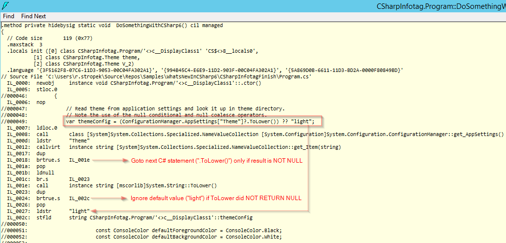

# What's New in C# 6?

This lab demonstrates new feature of C# 6. I have used similar examples
in multiple magazine articles (e.g. [Windows Developer Magazine](https://windowsdeveloper.de/Windows-Developer/Windows-Developer-614-173207),
[Informatik Aktuell](http://www.informatik-aktuell.de/), etc.) 
and workshops (e.g. C# workshops at [BASTA](https://basta.net), 
[IT-Visions](http://www.it-visions.at/) Infoday, etc.). **Additionally,
I have written a [blog article](http://www.software-architects.com/devblog/2014/12/04/NET-Infoday-Whats-New-in-C-6)
containing additional information on the topic**.

Kudos for this sample to [Roman Schacherl from softaware](http://www.softaware.at/About/Unser-Team)
(MVP for Windows Platform Development). We developed this sample together and
did conference sessions on the topic together, too.

## Null-Conditional Operator

Old code ([CSharpInfotagStart/Program.cs](CSharpInfotagStart/Program.cs)):

```C#
private static void DoSomethingWithCSharp6()
{
	// Read theme from application settings and look it up in theme directory.
	var themeConfig = ConfigurationManager.AppSettings["Theme"];
	if (themeConfig == null)
	{
		// If setting is missing, use light theme
		themeConfig = "light";
	}
	else
	{
		// Ignore casing so confert theme setting to lowercase
		themeConfig = themeConfig.ToLower();
	}

	const ConsoleColor defaultForegroundColor = ConsoleColor.Black;
	const ConsoleColor defaultBackgroundColor = ConsoleColor.White;

	Theme theme;
	if (themes == null || (theme = themes.FirstOrDefault(
		p => p.Name != null && p.Name.ToLower() == themeConfig)) == null)
	{
		// If themes have not been set up or requested theme could not be found, 
		// use default values
		Console.ForegroundColor = defaultForegroundColor;
		Console.BackgroundColor = defaultBackgroundColor;
	}
	else
	{
		Console.ForegroundColor = theme.ForegroundColor;
		Console.BackgroundColor = theme.BackgroundColor;
	}
}
```

New code ([CSharpInfotagFinish/Program.cs](CSharpInfotagFinish/Program.cs)):

```C#
private static void DoSomethingWithCSharp6()
{
	// Read theme from application settings and look it up in theme directory.
	// Note the use of the null conditional and null coalesce operators.
	var themeConfig = (ConfigurationManager.AppSettings["Theme"]?.ToLower()) ?? "light";

	const ConsoleColor defaultForegroundColor = ConsoleColor.Black;
	const ConsoleColor defaultBackgroundColor = ConsoleColor.White;

	// Note the use of multiple null conditional operators.
	var theme = themes?.FirstOrDefault(p => p.Name?.ToLower() == themeConfig);

	// If themes have not been set up or requested theme could not be found, 
	// use default values.
	// Note that the null conditional operator in "theme?.ForegroundColor" changes
	// the expression's type from "ConsoleColor" to "Nullable<ConsoleColor>". So
	// the following line would result in a compiler error:
	// ConsoleColor foreground = theme?.ForegroundColor;
	Console.ForegroundColor = theme?.ForegroundColor ?? defaultForegroundColor;
	Console.BackgroundColor = theme?.BackgroundColor ?? defaultBackgroundColor;
}
```

Interested what happens behind the scenes? Here is the IL-Code of the sample shown above:



### Null-Conditional Operator and Events

Old code ([CSharpInfotagStart/Theme.cs](CSharpInfotagStart/Theme.cs)):

```C#
public string Name
{
	get { return NameValue; }
	set
	{
		if (NameValue != value)
		{
			NameValue = value;
			if (this.PropertyChanged != null)
			{
				this.PropertyChanged(this, new PropertyChangedEventArgs("Name"));
				this.PropertyChanged(this, new PropertyChangedEventArgs("FullName"));
			}
		}
	}
}
```

New code ([CSharpInfotagFinish/Theme.cs](CSharpInfotagFinish/Theme.cs)):

```C#
public string Name
{
	get { return NameValue; }
	set
	{
		if (NameValue != value)
		{
			NameValue = value;

			// Note the use of the null conditional and nameof Operators here
			PropertyChanged?.Invoke(this, new PropertyChangedEventArgs(nameof(Theme.Name)));
			PropertyChanged?.Invoke(this, new PropertyChangedEventArgs(nameof(FullName)));
		}
	}
}
```

Also note the new `nameof` Operator in the sample code above.

## Index Initializers

```C#
// Collection Initializers
themes = new List<Theme>
{
	new Theme("dark", ConsoleColor.Black, ConsoleColor.White),
	new Theme("light", ConsoleColor.White, ConsoleColor.Black),
	new Theme("winter", ConsoleColor.Gray, ConsoleColor.Gray)
		// everything's gray in Austrian winter.
};

// Index Initializers
themesIndex = new Dictionary<string, Theme>
{
	["dark"] = themes[0],
	["light"] = themes[1],
	[themes[2].Name] = themes[2]
		// Note the usage of an expression as the index here
};
```

## Enhancements for auto-implemented properties

Old code ([CSharpInfotagStart/Theme.cs](CSharpInfotagStart/Theme.cs)):

```C#
// Note that we cannot make BackgroundColor readonly if we use 
// auto-implemented properties. Also note that prior to C# 6 we
// could not initialize value of BackgroundColor here.
public ConsoleColor BackgroundColor { get; private set; }

// Note that we cannot use auto-implemented properties if we want
// to use readonly.
private readonly ConsoleColor ForegroundColorValue = ConsoleColor.Black;
public ConsoleColor ForegroundColor { get { return this.ForegroundColorValue; } }

public Theme(string name, ConsoleColor backgroundColor, ConsoleColor foregroundColor)
{
	[...]
	this.BackgroundColor = backgroundColor;
	this.ForegroundColorValue = foregroundColor;
}

public Theme()
{
	// Set default colors
	this.ForegroundColorValue = ConsoleColor.Black;
}
```

New code ([CSharpInfotagFinish/Theme.cs](CSharpInfotagFinish/Theme.cs)):

```C#
// Note the use of a getter-only property with initializer here.
public ConsoleColor BackgroundColor { get; } = ConsoleColor.White;

public ConsoleColor ForegroundColor { get; } = ConsoleColor.Black;

public Theme(string name, ConsoleColor backgroundColor, ConsoleColor foregroundColor)
{
	[...]
	this.BackgroundColor = backgroundColor;
	this.ForegroundColor = foregroundColor;
}

public Theme()
{
	// No need to set default values any more.
}
```

## Expression-bodied members

Old code ([CSharpInfotagStart/Theme.cs](CSharpInfotagStart/Theme.cs)):

```C#
public string FullName
{
	get
	{
		return string.Format("Theme: {0}, Background: {1}, Foreground: {2}",
			this.Name, this.BackgroundColor, this.ForegroundColor);
	}
}

public Theme Clone()
{
	return new Theme(this.Name, this.BackgroundColor, this.ForegroundColor);
}
```

New code ([CSharpInfotagFinish/Theme.cs](CSharpInfotagFinish/Theme.cs)):

```C#
// Note the use of Lambda bodied property here.
// The exact syntax of string interpolations will change until RTM of VS2015.
public string FullName => 
	"Theme: \{Name}, Background: \{BackgroundColor}, Foreground: \{ForegroundColor}";

// Note the use of Lambda bodied function here.
public Theme Clone() => new Theme(this.Name, this.BackgroundColor, this.ForegroundColor);
```

Also note the new string interpolation feature in the sample code above.

## Exception handling enhancements

Old code ([CSharpInfotagStart/Program.cs](CSharpInfotagStart/Program.cs)):

```C#
private static async Task InitializeThemesAsync()
{
	var exceptionMessage = string.Empty;
	try
	{
		InitializeThemes();
	}
	catch (Exception ex)
	{
		if (ex.InnerException != null)
		{
			// For demo purposes, lets say we are just interested in the
			// inner exception. If there is no inner exception, we do not
			// want to handle the exception.
			exceptionMessage = ex.InnerException.Message;
		}
		else
		{
			throw;
		}
	}

	// Now that we are ouside of catch, we can use await.
	await LogAsync(exceptionMessage);
}
```

New code ([CSharpInfotagFinish/Program.cs](CSharpInfotagFinish/Program.cs)):

```C#
private static async Task InitializeThemesAsync()
{
	var exceptionMessage = string.Empty;
	try
	{
		InitializeThemes();
	}
	// Note the exception filter here.
	catch (Exception ex) if (ex.InnerException != null)
	{
		// Note the usage of await inside of catch
		await LogAsync(exceptionMessage);
	}
}
```
